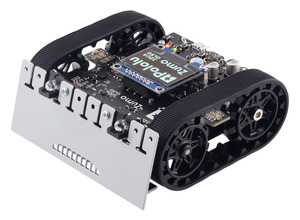

# LineFollower-Robot Team Project
  
A robot, which follows a black line using line sensors.  
Special features include:
- A user interface on the OLED screen with 3 different running settings
- Gap Handling
- Time measurement and distance measurement for each run
- Clean error handling

## Videos of the Zumo in action:
- [Ultra Performance Track - Uncuccessful run](https://drive.google.com/file/d/11UmHGwZcgR4-zAQzRrmi9Z3cv77mWBfe/view?usp=sharing)
- [Ultra Performance Track - Successful run](https://drive.google.com/file/d/11fx8QAsk25D5qmZLhgk9yqIh9yYARoC1/view?usp=sharing)
- [Performance Track - Successful run](https://drive.google.com/file/d/12VChH-9JJiB1CIP_mzVOU0V2ho85SU6y/view?usp=sharing)
- [Remote development at home](https://drive.google.com/file/d/12Vm6Z2NtBgFjGL-lRJlZtP5Dg3OHjfs0/view?usp=sharing)

Each week we held 2 meetings to discuss our problems or review the results. After every lecture each team member had a task for that week(depends) and had to create his or her own branch to implement/ solve the task. 
The GITLAB repository was modified so it was not possible to merge branches into the MAIN without the approval of at least one other team member. So before any merge, the code and changes were thoroughly reviewed. 
In order for everyone to have a good overview what the other members are currently working on, we used a [Kanban Board](https://de.wikipedia.org/wiki/Kanban-Board) using [Gitlab issue boards](https://docs.gitlab.com/ee/user/project/issue_board.html).  

# Phases
The project was generaly divided into 4 phases(or [epics](https://docs.gitlab.com/ee/user/group/epics/))
- Analysis
- Design
- Implementation
- Test

## Analysis
Creation of various documents or diagrams:
- [Software-Requirement-Specification(SRS)](https://www.perforce.com/blog/alm/how-write-software-requirements-specification-srs-document)
- [Use-Case-Diagrams](https://www.ionos.de/digitalguide/websites/web-entwicklung/anwendungsfalldiagramm/)
- [Architecture Diagrams](https://aws.amazon.com/de/what-is/architecture-diagramming/)

## Design
Creation of the class diagrams

## Implementation
The implementation step included a lot of [integration tests](https://de.wikipedia.org/wiki/Integrationstest).  
The implementation steps were roughly:
- state machine
- hardware layer(to ensure each hardware module was functioning properly)
- each state specifically(start-up, calibration, ready/ idle, error, finish, run)

## Testing
Partly the test consisted of the integration tests during the implementation process.  
The other important part of tests were the unit tests implemented with the [Unity Test Framework](https://docs.unity3d.com/Packages/com.unity.test-framework@1.1/manual/index.html) using the simulated Hardware using the simulated Hardware using the HWSIM-classes(see below in 'Image' section)

## What I was part of
- Implementation of the acting package in the hardware layer - the control over the motor module
- Implementation of the run state which is responsible for line-follow-handling/ gap handling etc.
- Implementation of the unit tests for the run state

## The Unity Test Framework
- UTF is not an object-oriented framework
- UTF is written in C which makes it particularly suitable for unit tests in embedded systems with smaller processors which almost always support C
- More about UTF [here](https://docs.unity3d.com/Packages/com.unity.test-framework@1.4/manual/index.html)

## Goal of the Project
- The ability to realize a greater object-oriented softwareproject
- Aswell as the know-how to use the distributed version control system GIT in a smaller team
- Clean documentation using [Doxygen](https://www.doxygen.nl/index.html)
- Clean coding with a specific coding-style given by the lecturer
- Creating UML-Diagrams using [PlantUML](https://plantuml.com/de/)
- Well structured software development process - in this case the (V Model)

## Images

### The *Ultra Performance Track* and *Basic Track*

### The *Test Tracks*

### *V Model* 
  

### *Example of a kanban or issue board*

### *The whole UML class diagram of the project(redacted)*  
  

### *Compromised design of the User Interface on the OLED-Screen*

### *GITLAB Contribution activity - Repository is private* [link to gitlab](https://hs-ulm-ikt-gitlab.westeurope.cloudapp.azure.com/hduong)  

## Official Sources of Content and Images
[Polulul - Robotics and Electronics](https://www.pololu.com/docs/0J63/all)  
[V Model](https://builtin.com/software-engineering-perspectives/v-model)  
[PlantUML](https://plantuml.com/de/)  
[Official Zumo 32U4 Library](https://pololu.github.io/zumo-32u4-arduino-library/)

## Disclaimer

Due to privacy issues I will sum up all details and knowledge I have gained during the project.  
I DO NOT OWN ANY RIGHTS OF THE IMAGES USED - UPON REQUEST I WILL REMOVE THEM ASAP!
